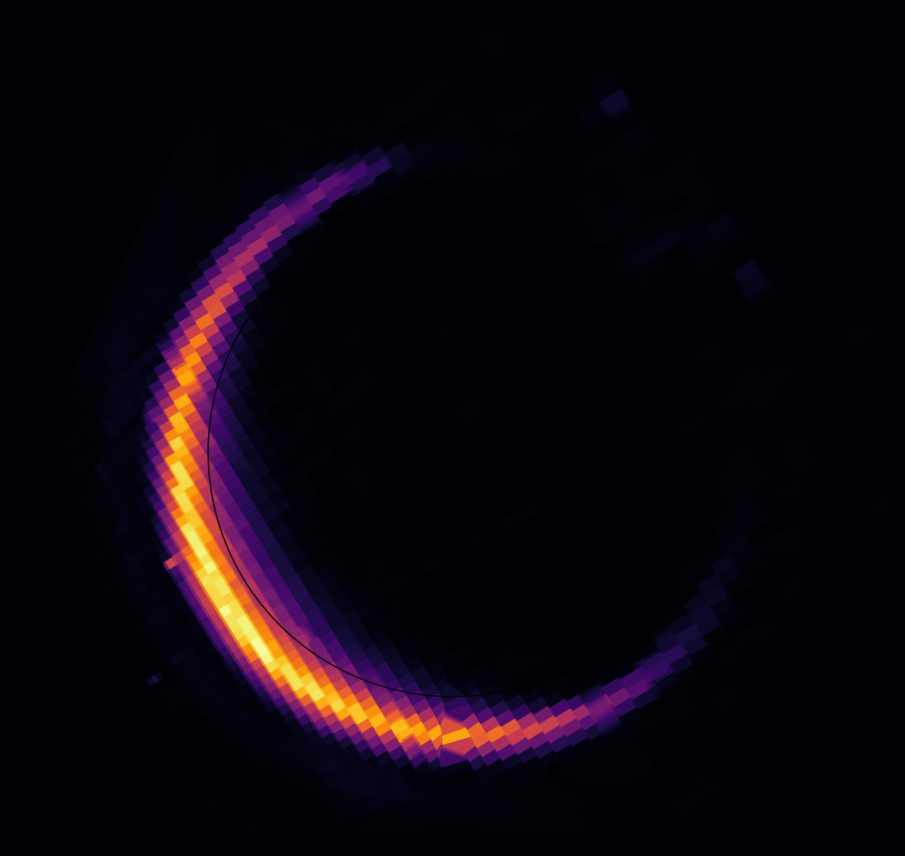

# Cassini-UPyP
<div style="display: flex; gap: 1rem; align-items: flex-start;">


  <div style="flex: 1;">
    <p>
    The <strong>Cassini UVIS Python Package</strong> is a research-oriented Python toolbox for reading, processing and analysing data from the <a href="https://lasp.colorado.edu/cassini/">UltraViolet Imaging Spectrograph (UVIS)</a> on board the Cassini spacecraft.
    </p>
    <p>
    The package aims to provide tools to work with UVIS data, display informations, compute geometry, plot spectra and related products and prepare such data to further processing if needed like forward modelling.
    The package is not designed as a black-box tool. The code is meant to be clean, inspectable, and modifiable: if you need to tweak methods or routines for your own analysis, you should feel comfortable doing so.
    </p>
  </div>


  <div style="flex: 0 0 320px;">
    
  </div>
</div>


## Main classes
- [UVIS_Observation](api/uvisdata_UVIS_Observation)
- [UVIS_Bin](api/uvisdata_UVIS_Bin)

## Documentation
```{toctree}
:maxdepth: 1

installation
resources
configuration

api/index

examples/index
```